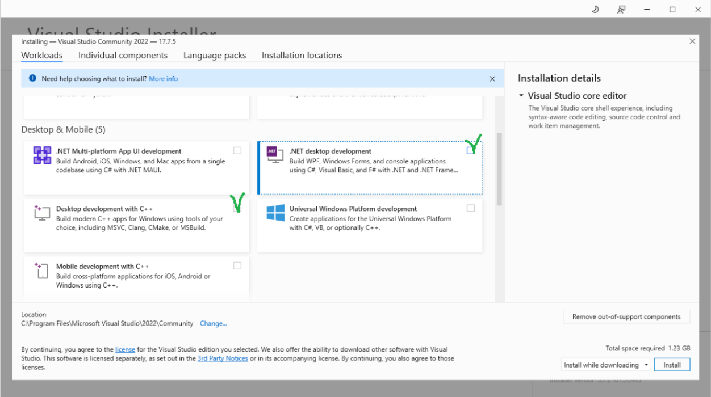
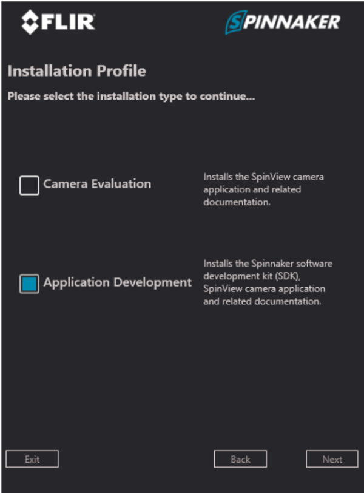
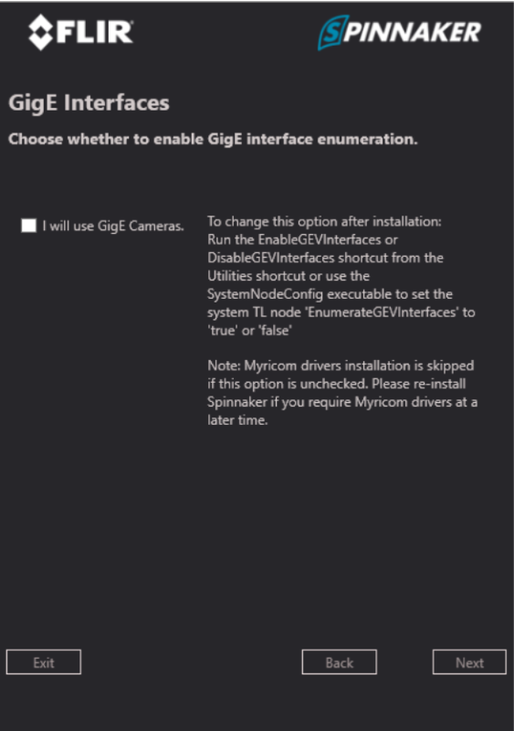
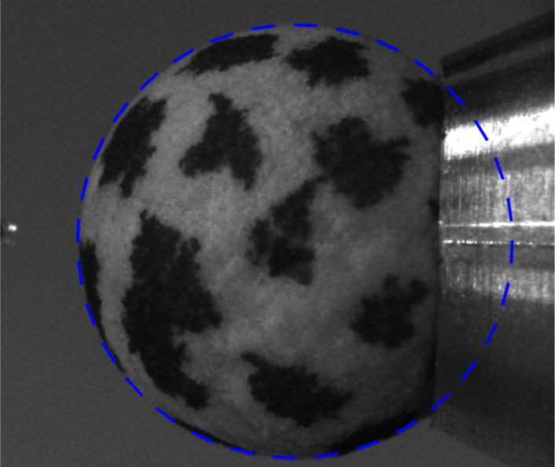
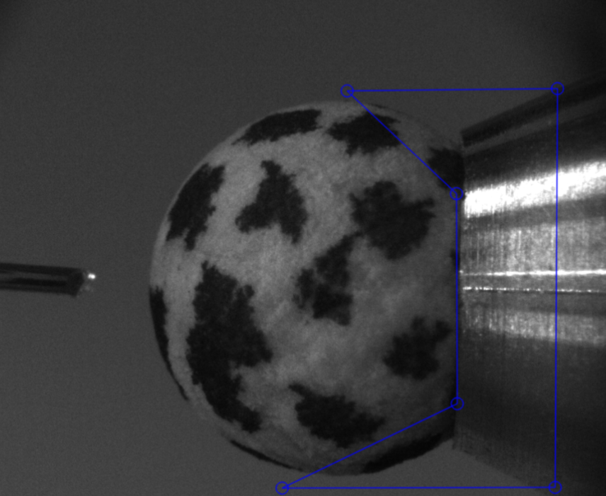

## Tracking the ball

### Install Visual Studio Community
1. Download Visual Studio <b>Community</b> from  from <a href="https://visualstudio.microsoft.com/free-developer-offers/">here</a>
2. During the installation process, make sure to include <i>Desktop development with C++</i> and <i>.NET desktop development</i><p align="center"></p>
  

### Install Spinnaker SDK

1. $\color{red}{\textrm{Install Spinnaker SDK 2.7.0.128 ☠️☠️☠️ because Fictrac might be incompatible with newest versions}}$ <a href="https://www.flir.com/support-center/iis/machine-vision/downloads/spinnaker-sdk-download/spinnaker-sdk--download-files/">Here</a>

2. Unzip and run SpinnakerSDK_FULL_2.7.0.128_x64.exe
   
3. Check the box “Application Development” 
  <p align="center"></p>
4. Uncheck the box “I will use GigE Cameras”
  <p align="center"></p>

5. Install to C:\Program Files\FLIR Systems\Spinnaker
       
### Install FicTrac
1. Follow the instructions on <a href="https://github.com/rjdmoore/fictrac">Fictrac official page</a> OR assuming you are using windows 10 and we will work with FLIR cameras, do as follow:
  1. Install the Windows x64 version of <a href="https://git-scm.com/download/win">Git</a>
  2. Type “Developer Command Prompt” in the Window Search Bar and open the app “Developer Command Prompt for VS 2022” as an administrator
  3. To install and setup vcpkg, write:

     1. $\color{red}{\textrm{first, adjust with your own user's folder name !}}$
         ```
         cd C:\Users\[your user folder]
         ```
         
     2.
         ```
         git clone https://github.com/microsoft/vcpkg
         ```
     3.
         ```
         .\vcpkg\bootstrap-vcpkg.bat
         ```
     4.
         ```
         .\vcpkg\vcpkg integrate install
         ```
     5. This might take a LOT of time, $\color{red}{\textrm{DO NOT PANIC!}}$
         ```
         .\vcpkg\vcpkg install opencv[ffmpeg]:x64-windows nlopt:x64-windows boost-asio:x64-windows ffmpeg[x264]:x64-windows
         ```
     6. $\color{green}{\textrm{This will install all the FicTrac files in your user folder}}$
         ```
         git clone https://github.com/rjdmoore/fictrac.git
         ```
      
  5. Keep the command prompt window open
  6. $\color{green}{\textrm{For closed-loop, our setup requires some modifications on Fictrac for it to upload its output on a shareable memory slot).}}$
     1. Download our <a href="https://github.com/ActiveSensing/Closed-loop-Setup/tree/6d2a63457c770fb227c58e4a4bd8440098107d2e/modified%20scripts">modified files</a> 
     2. Replace SocketRecorder.cpp in C:\Users\[your user folder]\fictrac\src\
     3. Replace SocketRecorder.h in C:\Users\[your user folder]\fictrac\include\
  7. Reopen the “Developer Command Prompt for VS 2022” window and write:
     
     1. 
         ```
         cd fictrac
         ```
     2. 
         ```
         mkdir build
         ```
     3. 
         ```
         cd build
         ```
     4. $\color{green}{\textrm{This will generate pre-compilation files for FicTrac in the newly created “build” folder.}}$
        $\color{green}{\textrm{Therefore we mention the path to the vcpkg, the fact that we are going to use USB3 cameras, and the path to spinnakerSDK}}$
         ```
         cmake -A x64 -D CMAKE_TOOLCHAIN_FILE="C:\Users\[your user folder]\vcpkg\scripts/buildsystems/vcpkg.cmake" -D PGR_USB3=ON -D PGR_DIR="C:\Program Files\FLIR Systems\Spinnaker" ..
         ```
     6. 
         ```
         cmake --build . --config Release -j 4
         ```

  8. Close the “Developer Command Prompt for VS 2022”


### Use FicTrac
#### Configure FicTrac
1. Make sure the camera looking at the ball is plugged to the computer
2. Create a new folder for your Fictrac project on the Desktop
3. In this folder, paste <a href="https://github.com/ActiveSensing/Closed-loop-Setup/tree/6d2a63457c770fb227c58e4a4bd8440098107d2e/modified%20scripts">this config.txt file</a>
  1. $\color{green}{\textrm{In config.txt, all the parameters (except the modified sock port) are explained}}$ <a href="https://github.com/rjdmoore/fictrac/blob/master/doc/params.m">in the fictrac's official documentation</a>
  2. $\color{green}{\textrm{In our specific setup, following parameters are important:}}$
     1. <b>Src_fn :  0</b><code style="color : grey">  # Mention which FLIR camera should be used. The camera that was first plugged into the computer is ‘0’, next ‘1’, …</code>
      
     2. <b>c2a_r : { 0, 4.712388, 0}</b><code style="color : grey">  # Specify the fly orientation (looking outward the camera) by adjusting the default Y axis to 1.5 pi</code>
      
     3. <b>vfov : 2.9</b><code style="color : grey">  # Set the correct lens’ vertical field of view (this is estimated because the real value is hard to calculate without a mount adapter for our lense</code>
      
     4. <b>sock_port : 2305</b><code style="color : grey">  #Send the tracking output to a shared memory slot with the name “2305” (handled by our customised SocketRecorder files)</code>
        $\color{red}{\textrm{!!! ONLY FOR CLOSED-LOOP, OTHERWISE REMOVE THIS LINE !!!}}$
      
     5. Might want to adjust the thr_ratio and thr_win_pc parameters according to your stained ball

4. In a command prompt write:
   
    1. $\color{red}{\textrm{First, adjust with the path of your own new FicTrac project}}$
       ```
       cd [Path to your FicTrac project]
       ```
    2. $\color{red}{\textrm{First, adjust the name of your own user's folder}}$
       ```
       C:\Users\[your user folder]\fictrac\bin\Release\configGui.exe config.txt
       ```
       This will run the GUI interface to help visually setting up some FicTrac parameters from the config.txt file
       
       1. In the configGUI interface, you should see an image with a blue circle on it. If the view is from a wrong camera, change the Src_fn parameter in the config.txt file
          
       3. In the command prompt, write ‘n’ to modify the ball’s outline
          - In the GUI window, click three random points at the horizon of the ball, then press enter (right click undo your previous points)
<p align="center">

</p>
       4. Back in the command prompt, press n to modify the masked area (the part of the balls hidden by the ball holder and by the fly itself)
          - For each area click the corner of the shape you want to mask from the tracking, then press enter. When all the masked areas are defined, press enter again.
<p align="center">

</p>
       5. Back in the command prompt, press “y” to NOT MODIFY THE POSITION OF THE FLY since it is already set in the config file perfectly at the top of the ball and looking forward

1. Run FicTrac
  - In a command prompt write:

    1. $\color{red}{\textrm{First, adjust with the path of your own new FicTrac project}}$
       ```
       cd [Path to your FicTrac project]
       ```
    2. $\color{red}{\textrm{First, adjust with the path of your own new FicTrac project}}$
       ```
       C:\Users\[your user folder]\fictrac\bin\Release\fictrac.exe config.txt
       ```
> [!TIP]
> 1. Once in a while, You might want to restart the GUI config in order to readjust the ball’s outline and masked areas. Because the camera position and lighting of the setup might have slightly changed
> 2. In a text file inside your FicTrac project folder, save the command lines used previously. Next time you use Fictrac, you could just copy paste them in the command prompt.

<br />
<br />
<br />

## Show a Responsive Stimulus on the Curved Screen (Closed-Loop)
### Install SuperBowl
1. Download the whole SuperBowl <a href="https://github.com/borstlab/super_bowl_screen/tree/main">Git folder</a> and unzip it somewhere on your computer
2. In [Your SuperBowlFolder]\Software\ , replace the <i>“bowl_stimulate_class.py”</i> with our <a href="https://github.com/ActiveSensing/Closed-loop-Setup/tree/6d2a63457c770fb227c58e4a4bd8440098107d2e/modified%20scripts">own customised version</a> (which include a RotateWithFicTrac() function)
3. Search and install the last version of Python on the Microsoft Store
4. Open a command prompt and Install jupyter lab and the necessary libraries by writing:
  1.
     ```
     python -m pip install jupyterlab
     ```
     You might get an error saying “This error might have occurred since this system does not have Windows Long Path support enabled.”
  - To fix it, open the “Registry Editor”
  - navigate to HKEY_LOCAL_MACHINE\SYSTEM\CurrentControlSet\Control\FileSystem
  - Open “LongPathsEnabled” and set its value to 1

  3.
     ```
     python -m pip install numpy
     ```
  4.
     ```
     python -m pip install opencv-python
     ```
  5.
     ```
     python -m pip install pylab-sdk
     ```
  6.
     ```
     python -m pip install matplotlib
     ```
  7.
     ```
     python -m pip install --upgrade "jax[cpu]"
     ```
  8.
     ```
     python -m pip install math
     ```
  9.
     ```
     python -m pip install datetime
     ```

### Use SuperBowl
1. You can copy on your desktop the exemple file called <a href="https://github.com/ActiveSensing/Closed-loop-Setup/tree/6d2a63457c770fb227c58e4a4bd8440098107d2e/modified%20scripts"><i>Stimulus_ClosedLoop.ipynb</i></a>
2. Open jupyterlab by writing in a command prompt:
   ```
   python -m jupyterlab
   ```
3. Jupyterlab should open in your browser. In the left Panel, navigate to where you copied <i>Stimulus_ClosedLoop.ipynb</i> and open it
4. In the first lines of the script replace what is inside <i>path.append(r'[PATH]\super_bowl_screen-main\Software')</i> with the folder's path where SuperBowl is installed
5. You can see that this script calls the RotateWithFicTrac() function from our Icustomized “bowl_stimulate_class.py”
    1. The first argument (e.g. <i>Arena.bar_vertical(width=30, color=0, color_b=125)</i>) gets the image that will rotate
    2. <i>inverted=True</i> sepcifies that our bowl screen is upside-down in our setup.
    3. <i>MMapName="2305"</i> specifies the name of the shared memory slot where FicTrac uploads its tracking (As mentioned in the <i>config.txt</i> of Fictrac)
    4. <i>gain=<b>1</b></i> means that for each degree of the ball's rotation, the stimulus will rotate of <i><b>1</b></i> degree
    5. <i>duration=-1</i> means that code should run without time limits. Change the value to any number to set a timer in <b>seconds</b>
    6. <i>rot_offset=(0,50,0)</i> rotates the virtual sphere projected auround the flies. Before experimenting, this should be corrected with the orientation of the fly on the ball
