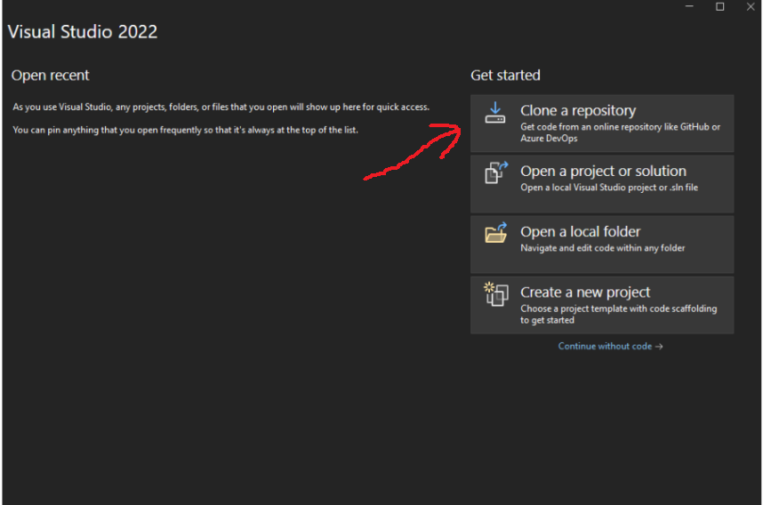
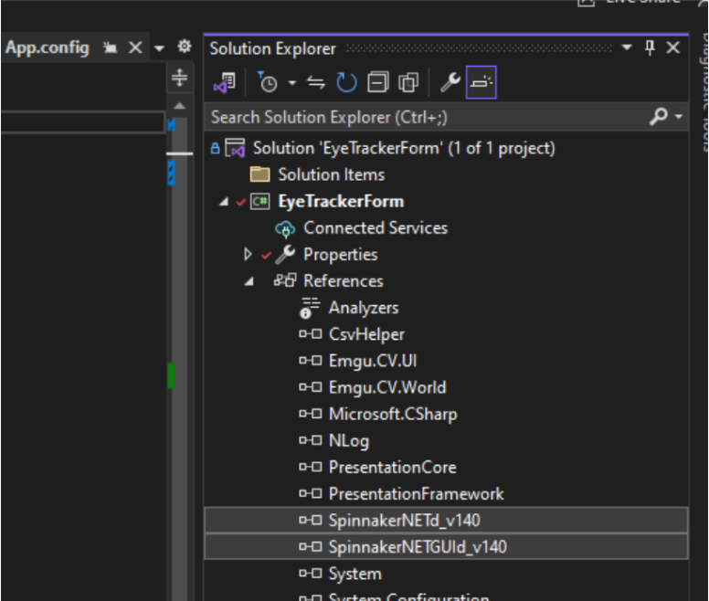
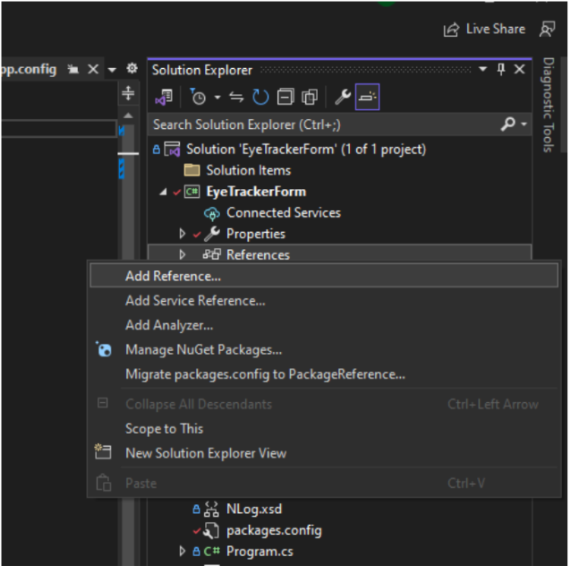
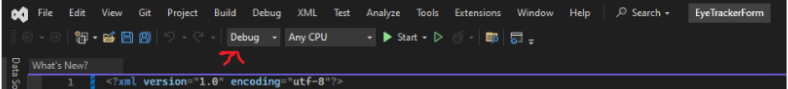
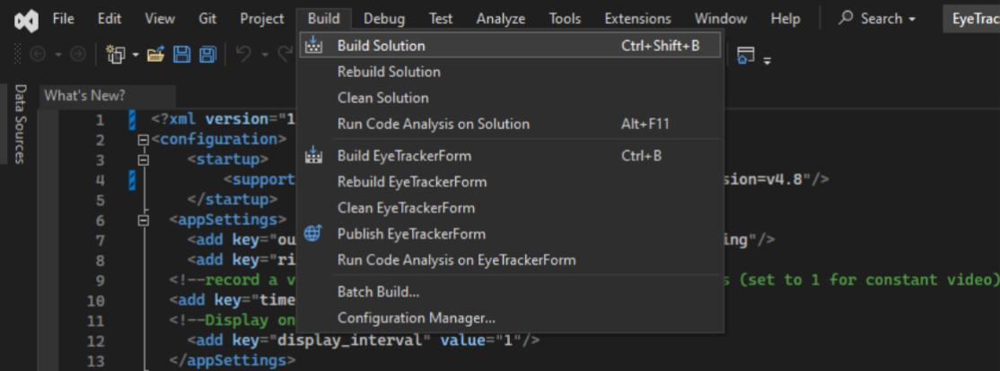

## Tracking the ball

### Install visual studio Community
1. Download visual studio Community from  from <a href="https://visualstudio.microsoft.com/free-developer-offers/">here</a>
2. During the installation process, make sure to include <i>Desktop development with C++</i> and <i>.NET desktop development</i>
<p align="center">
  
</p>
  

### Install spinnaker SDK
1. $\color{red}{\textrm{Install Spinnaker SDK 2.7.0.128 ☠️☠️☠️ because Fictrac might be incompatible with newest Spinnaker SDK}}$ <a href="https://www.flir.com/support-center/iis/machine-vision/downloads/spinnaker-sdk-download/spinnaker-sdk--download-files/">Here</a>
2. Unzip and run SpinnakerSDK_FULL_2.7.0.128_x64.exe
  1. Check the box “Application Development”
  <p align="center">
  
  </p>
  3. Uncheck the box “I will use GigE Cameras”
  <p align="center">
  
  </p>
  4. Install to
       ```
       C:\Program Files\FLIR Systems\Spinnaker
       ```
       
### Install FicTrac
1. Follow the instructions on <a href="https://github.com/rjdmoore/fictrac">Fictrac official page</a> OR assuming you are using windows 10 and we will work with FLIR cameras, do as follow:
  1. Install the Windows x64 version of <a href="https://git-scm.com/download/win">Git</a>
  2. Type “Developer Command Prompt” in the Window Search Bar and open the app “Developer Command Prompt for VS 2022” as an administrator
  3. To install and setup vcpkg, write:

     1.
         ```
         cd C:\Users\[your user folder]
         ```
     2.
         ```
         git clone https://github.com/microsoft/vcpkg
         ```
     3.
         ```
         .\vcpkg\bootstrap-vcpkg.bat
         ```
     4.
         ```
         .\vcpkg\vcpkg integrate install
         ```
     5. This might take a LOT of time, DO NOT PANIC
         ```
         .\vcpkg\vcpkg install opencv[ffmpeg]:x64-windows nlopt:x64-windows boost-asio:x64-windows ffmpeg[x264]:x64-windows
         ```
     6. This will install all the FicTrac files in your user folder
         ```
         git clone https://github.com/rjdmoore/fictrac.git
         ```
      
  5. Keep the command prompt window open
  6. Our setup requires some modification on Fictrac in order to send its output to a public memory on your computer (later used by the close-loop stimulus software).
     1. Download our <a href="https://drive.google.com/drive/folders/1S8Fbw5yJJ7K2ZgSIMgYnA-w1dTtG_ro4?usp=share_link">modified files</a> 
     2. Replace SocketRecorder.cpp in
          ```
          C:\Users\[your user folder]\fictrac\src\
          ```
     3. Replace SocketRecorder.h in
          ```
          C:\Users\[your user folder]\fictrac\include\
          ```
  7. Reopen the “Developer Command Prompt for VS 2022” window and write:
     
     1. 
         ```
         cd fictrac
         ```
     2. 
         ```
         mkdir build
         ```
     3. 
         ```
         cd build
         ```
     4. This will generate compilation files for FicTrac in the newly created “build” folder. Therefore we mention the path to the vcpkg, the fact that we are going to use USB3 cameras, and the path to spinnakerSDK
         ```
         cmake -A x64 -D CMAKE_TOOLCHAIN_FILE="C:\Users\[your user folder]\vcpkg\scripts/buildsystems/vcpkg.cmake" -D PGR_USB3=ON -D PGR_DIR="C:\Program Files\FLIR Systems\Spinnaker" ..
         ```
     5. 
         ```
         cmake --build . --config Release -j 4
         ```

  8. Close the “Developer Command Prompt for VS 2022”


### Use FicTrac
1. Make sure the camera looking at the ball is plugged to the computer
2. Configure FicTrac
  1. Create a new folder for your Fictrac project on the Desktop
  2. In this folder, paste <a href="https://drive.google.com/drive/folders/1S8Fbw5yJJ7K2ZgSIMgYnA-w1dTtG_ro4?usp=share_link">this config.txt file</a>

     1. All the parameters (except the modified sock_port) in the config.txt are explained <a href="https://github.com/rjdmoore/fictrac/blob/master/doc/params.m">in the fictrac's official documentation</a>
     
     2. In our specific setup, following parameters are important:
       1. Src_fn :  0 	# Mention which FLIR camera should be used. The camera that was first plugged into the computer is ‘0’, next ‘1’, …
      
       2. c2a_r : { 0, 4.712388, 0} 	# Align the fly in front of the camera
      
       3. vfov : 2.9		# Set the correct lens’ vertical field of view
      
       4. sock_port  : 2305	#Send the tracking output to a shared memory slot with the name “2305” (handled by our customised SocketRecorder files) !!! ONLY FOR CLOSED LOOP EXPERIMENTS, OTHERWISE REMOVE THIS LINE !!!
      
       5. Might want to adjust the thr_ratio and thr_win_pc parameters according to your stained ball

3. In a command prompt write:
   
    1.
       ```
       cd [Path to your FicTrac project]
       ```
    2.
       ```
       C:\Users\[your user folder]\fictrac\bin\Release\configGui.exe config.txt
       ```
       This will run the GUI interface to help visually setting up some FicTrac parameters from the config.txt file
       
       1. In the configGUI interface, you should see an image with a blue circle on it. If the view is from a wrong camera, change the Src_fn parameter in the config.txt file
          
       3. In the command prompt, write ‘n’ to modify the ball’s outline
          - In the GUI window, click three random points at the horizon of the ball, then press enter (right click undo your previous points)
<p align="center">

</p>
       4. Back in the command prompt, press n to modify the masked area (the part of the balls hidden by the ball holder and by the fly itself)
          - For each area click the corner of the shape you want to mask from the tracking, then press enter. When all the masked areas are defined, press enter again.
<p align="center">

</p>
       5. Back in the command prompt, press “y” to NOT MODIFY THE POSITION OF THE FLY since it is already set in the config file perfectly at the top of the ball and looking forward

1. Run FicTrac
  - In a command prompt write:

    1.
        ```
        cd [Path to your FicTrac project]
        ```
    2.
        ```
        C:\Users\[your user folder]\fictrac\bin\Release\fictrac.exe config.txt
        ```

  - TIPS:
    1. Once in a while, You might want to restart the GUI config in order to readjust the ball’s outline and masked areas. Because the camera position and lighting of the setup might have slightly changed
    2. In a text file inside your FicTrac project folder, save the command lines used previously. Next time you use Fictrac, you could just copy paste them in the command prompt.
   

### Track the eyes
#### Install EyeTrackerForm
1. Create a new folder where your eye tracking data should be saved
2. Create a new folder where to install EyeTrackingForm (WITHOUT SPACES IN THE NAME), preferably under your user folder along with FicTrac
3. Open Visual Studio 2022 and click on ‘Clone a repository”
<p align="center">

</p>
5. In “Repository location”, paste
  ```
  https://github.com/ActiveSensing/EyeTracker-2.0.git
  ```
5. In “Path”, give the path to your newly created folder (ref. Step 2.)
6. Refresh the SpinnakerSDK libraries (ONLY IF YOUR ARE USING A SPINNAKER VERSION ABOVE 2.7.0.128)
    1. In the “Solution Explorer” panel, click on “References” under EyeTrackerForm, then select and delete <i>“SpinnakerNETGUI_v140.dll”</i> and <i>“SpinnakerNETd_v140.dll”</i>
<p align="center">

</p>
    2. Right click on “References”, then click on “Add Reference…”
<p align="center">

</p>
    3. Then click on “Browse”, and select “SpinnakerNETGUI_v140.dll” and “SpinnakerNET_v140.dll” in the folder where spinnaker libraries are installed. For spinnaker versions below 4, it should be C:\Program Files\FLIR Systems\Spinnaker\bin\vs2015
7. Change the build mode from “Debug” to ‘Release”
<p align="center">

</p>
8. Click on “Build”, then “Build Solution”
<p align="center">

</p>

#### Use EyeTrackerForm
1. Run the “EyeTrackerForm.exe” in [Path to your EyeTrackerForm install folder]\EyeTrackerForm\bin\Release
2. TIPS:
   - Create a shortcut of EyeTrackerForm.exe into to Eye Tracker project folder

### Show a responsive stimulus (Closed Loop)
#### Install SuperBowl
1. Download the whole SuperBowl <a href="https://github.com/borstlab/super_bowl_screen/tree/main">Git folder</a> and unzip it somewhere on your computer
2. In [Your SuperBowlFolder]\Software\ , replace the <i>“bowl_stimulate_class.py”</i> with our <a href="https://drive.google.com/drive/folders/1S8Fbw5yJJ7K2ZgSIMgYnA-w1dTtG_ro4?usp=share_link">own customised version</a> (which include a generate_fictracRotationalPipe() function)
3. Search and install the last version of Python on the Microsoft Store
4. Open a command prompt and Install jupyter lab and the necessary libraries by writing:
  1.
     ```
     python -m pip install jupyterlab
     ```
     You might get an error saying “This error might have occurred since this system does not have Windows Long Path support enabled.”
   - To fix it, open the “Registry Editor”
   - navigate to HKEY_LOCAL_MACHINE\SYSTEM\CurrentControlSet\Control\FileSystem
   - Open “LongPathsEnabled” and set its value to 1

  2.
     ```
     python -m pip install numpy
     ```
  3.
     ```
     python -m pip install opencv-python
     ```
  4.
     ```
     python -m pip install pylab-sdk
     ```
  5.
     ```
     python -m pip install matplotlib
     ```
  6.
     ```
     python -m pip install --upgrade "jax[cpu]"
     ```

#### Use SuperBowl
1. To open jupyterlab, write in a command prompt:
   ```
   python -m jupyterlab
   ```
2. Jupyterlab should open in your browser then navigate to [Your SuperBowlFolder]\Software\ and open “bowl example notebook.ipynb”
3. In “bowl example notebook.ipynb”, you can call our customised function as such: Arena.generate_fictracRotationalPipe(Arena.generate_bar_vertical(width=30, color1=0, color2=200, offset=90), inverted=True, MMapName="2305", gain=50, duration=-1)
  1. This would move a vertical bar based on the FicTrac’s output (caught in the shared Memory named “2305” as in the FicTrac’s configs (ref. USe FicTrac Step .2.b).
  2. This stimulus has no timer if duration is set to -1.
  3. Since in our setup, the curved screen is upside down, inverted=True is requires
